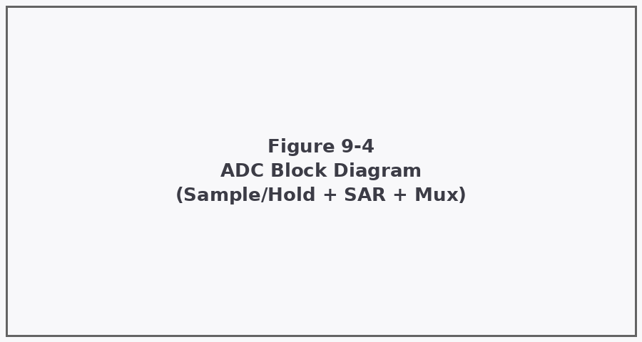
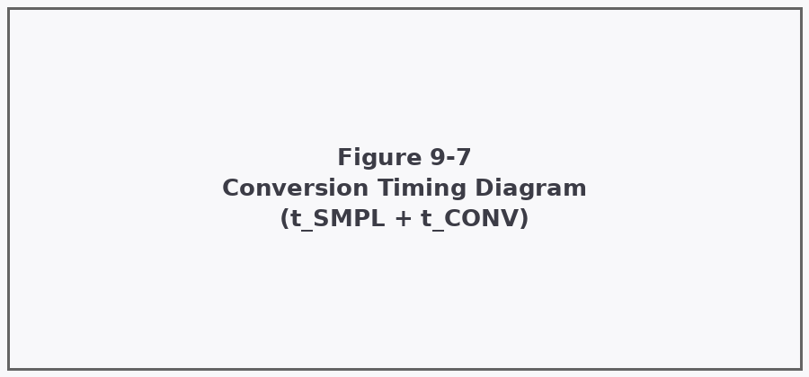

# MCU-X32F103 — Reference Manual Excerpt: ADC Peripheral

<!-- manifest:
  source_pdf: mcu_x32f103_reference_manual.pdf
  page_range: 3 (excerpt pages 1-3)
  generated: 2026-06-20
  format_version: 1.0
  device: MCU-X32F103
  index: index.json
-->

> A 3-page RAG-compliant excerpt demonstrating the full target format:
> prose for explanation, a JSON table of contents for routing, a LaTeX
> formula with a JSON index pointer, register bit-fields as primary
> JSON artifacts with a Markdown reference table, and captioned images
> tied to a figure manifest. See [`index.json`](./index.json) for the
> machine-readable document map.

---

## Page 1 — ADC Overview and Block Diagram {#page-1}

<!-- source: reference manual, page 1 -->
<!-- index: sec1-adc-overview -->

The MCU-X32F103 integrates a 12-bit successive-approximation (SAR)
analog-to-digital converter with up to 16 external input channels,
plus internal channels for temperature sensor and reference voltage
measurement. The converter supports single, continuous, scan, and
discontinuous conversion modes, selectable independently for regular
and injected channel groups.

Each conversion proceeds in two phases: a programmable sample-and-hold
phase, during which the input capacitor charges to the analog input
voltage, followed by a fixed successive-approximation phase, during
which the converter resolves the digital result one bit at a time
using a binary-search comparison against an internal DAC reference.

*Figure 9-4 — ADC block diagram. The analog multiplexer selects one of
up to 16 external channels (or an internal channel) and routes it to
the sample-and-hold stage, which feeds the SAR core. The result is
written to `ADC_DR` on completion.*

<!-- figure-ref: Figure 9-4 -->

The channel multiplexer is configured per-conversion through the
regular sequence registers (`ADC_SQR1`–`ADC_SQR3`), allowing up to 16
channels to be converted in a programmable order during scan mode. The
analog watchdog can monitor either a single selected channel or all
regular channels, comparing each result against high/low threshold
registers and asserting an interrupt if a conversion falls outside the
configured window.

> **DECISION:** for applications requiring deterministic sample timing
> across multiple channels (e.g. synchronized multi-channel
> acquisition), use scan mode with a fixed external trigger rather than
> continuous mode, since continuous mode's conversion start time
> relative to other peripherals is not deterministic.

---

## Page 2 — Conversion Timing and Sample Rate {#page-2}

<!-- source: reference manual, page 2 -->
<!-- index: sec2-adc-timing -->

Total conversion time is the sum of the programmable sample time and
the fixed successive-approximation time:

$$t_{CONV} = t_{SMPL} + t_{SAR} \tag{9-2}$$
<!-- formula-index: formulas/eq-9-2.json -->

where:
- $t_{CONV}$ — total conversion time, in ADC clock cycles
- $t_{SMPL}$ — sample time, programmable via `SMP[2:0]` per channel,
  from 1.5 to 239.5 cycles
- $t_{SAR}$ — successive-approximation time, fixed at 12.5 cycles for
  12-bit resolution (shorter for reduced resolution — see `RES` field
  in [`registers/ADC_CR1.json`](./registers/ADC_CR1.json))

For example, at an ADC clock of 14 MHz with the minimum sample time
($t_{SMPL} = 1.5$ cycles) and full 12-bit resolution:

$$t_{CONV} = 1.5 + 12.5 = 14 \text{ cycles} = \frac{14}{14\text{ MHz}} \approx 1.0\ \mu s \tag{9-3}$$

This corresponds to a maximum throughput of approximately 1 Msps
(mega-samples per second) under ideal conditions. Longer sample times
improve accuracy on high-impedance sources at the cost of reduced
throughput — see the source-impedance guidance in Section 9.4 of the
full manual (not included in this excerpt).

*Figure 9-7 — Conversion timing. The sample phase ($t_{SMPL}$) charges
the hold capacitor to the input voltage; the SAR phase ($t_{SAR}$)
resolves the 12-bit result through binary search. End-of-conversion
(EOC) is flagged in `ADC_SR` and `ADC_DR` is updated simultaneously.*

<!-- figure-ref: Figure 9-7 -->

> **OPEN:** the manual does not state EOC interrupt latency separately
> from $t_{CONV}$ — worth confirming against the errata sheet if
> sub-microsecond timing margins matter for a specific application,
> rather than assuming EOC assertion is instantaneous at the end of
> $t_{SAR}$.

---

## Page 3 — ADC Control Registers {#page-3}

<!-- source: reference manual, page 3 -->
<!-- index: sec3-adc-registers -->
<!-- registers: registers/ADC_CR1.json, registers/ADC_CR2.json -->

ADC behavior is configured through two control registers, `ADC_CR1`
and `ADC_CR2`. `ADC_CR1` governs resolution, scan mode, and the analog
watchdog; `ADC_CR2` governs power state, conversion mode, data
alignment, and trigger source.

### Enabling the ADC and starting a conversion

A typical software-triggered single-conversion sequence: set `ADON=1`
in `ADC_CR2` to power up the converter, wait the stabilization time
specified in the electrical characteristics table (not included in
this excerpt), then set `SWSTART=1` with `EXTTRIG=1` to begin
conversion of the regular channel group. The hardware clears `SWSTART`
automatically once conversion starts.

> Full bit-field reference for both registers, including every
> enumerated value, is in
> [`registers/ADC_CR1.json`](./registers/ADC_CR1.json) and
> [`registers/ADC_CR2.json`](./registers/ADC_CR2.json). The tables
> below summarize the fields most commonly configured; consult the
> JSON for exact bit positions and the complete set of encoded values.

**Table 9-3 — ADC_CR1 key fields (offset 0x04, reset 0x00000000)**

| Field | Bits | Access | Purpose |
|---|---|---|---|
| `RES` | 25:24 | R/W | Resolution: 12/10/8/6-bit, trades accuracy for $t_{SAR}$ |
| `SCAN` | 8 | R/W | Scan mode enable for multi-channel sequences |
| `AWDEN` | 23 | R/W | Analog watchdog enable on regular channels |
| `DISCEN` | 11 | R/W | Discontinuous mode enable |

**Table 9-4 — ADC_CR2 key fields (offset 0x08, reset 0x00000000)**

| Field | Bits | Access | Purpose |
|---|---|---|---|
| `ADON` | 0 | R/W | ADC power on/off |
| `CONT` | 1 | R/W | Continuous vs. single conversion mode |
| `ALIGN` | 11 | R/W | Result data alignment, left or right |
| `EXTTRIG` | 20 | R/W | External trigger detection enable |
| `SWSTART` | 22 | R/W | Software-triggered conversion start |

> **DECISION:** `RES` (resolution) lives in `ADC_CR1` while `ALIGN`
> (data alignment) lives in `ADC_CR2` — easy to mix up when writing
> initialization code from memory. Reference the JSON bit-field data
> directly rather than relying on recall, especially for the less
> frequently touched watchdog and discontinuous-mode fields.

---

<!-- end of excerpt -->
